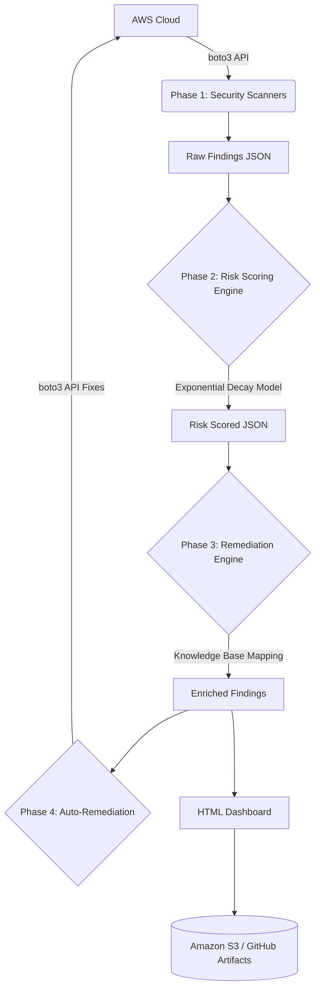

# AWS Cloud Misconfiguration Detection System

An industry-ready academic capstone project that scans AWS environments (IAM, S3, EC2, Lambda) for security misconfigurations, calculates contextual risk using an exponential decay scoring engine, maps vulnerabilities to remediation steps, **automatically fixes critical flaws**, and generates interactive HTML security dashboards. 

This project is fully automated via **GitHub Actions CI/CD** and **AWS Lambda** serverless architecture.

---

## 🎯 Key Features

- **Automated Deep Scanning**: Inspects IAM, S3, EC2, and Lambda against the CIS AWS Foundations Benchmark and AWS Security Best Practices (over 50 unique checks).
- **Contextual Risk Scoring Engine**: Calculates an overall **Security Posture Score (0-100)** using an *Exponential Decay Model* and identifies cross-service compound risks.
- **Remediation Recommendation Engine**: Maps findings to a knowledge base for step-by-step remediation guidance.
- **Auto-Remediation Engine**: Automatically applies boto3 API fixes to the live AWS environment for supported misconfigurations (see table below).
- **Interactive HTML Dashboard**: Generates a filterable UI to visualize threats, severity distribution, and remediation guides.
- **Serverless CI/CD Automation**: 
  - **AWS Lambda**: Deploys as a serverless function triggered by EventBridge.
  - **GitHub Actions**: Enterprise-grade CI/CD pipeline using passwordless **AWS OIDC** to run daily scans, auto-remediate, and publish artifacts.

---

## 🏗️ Architecture

The pipeline operates in four distinct phases managed by a central orchestrator (`main.py`):



---

## 🔧 Auto-Remediation Engine

The following misconfigurations are automatically fixed when the `--auto-remediate` flag is enabled:

| Service | Vulnerability | boto3 Fix Applied |
|---------|---------------|-------------------|
| **S3** | Public Bucket (Block Public Access disabled) | `put_public_access_block()` — blocks all public access |
| **S3** | Encryption Disabled | `put_bucket_encryption()` — enables AES-256 SSE |
| **S3** | Versioning Disabled | `put_bucket_versioning()` — enables versioning |
| **IAM** | Weak Password Policy | `update_account_password_policy()` — enforces 14 chars, symbols, 90-day expiry |
| **EC2** | SSH Open to World (0.0.0.0/0 on port 22) | `revoke_security_group_ingress()` — removes wildcard SSH rule |
| **EC2** | RDP Open to World (0.0.0.0/0 on port 3389) | `revoke_security_group_ingress()` — removes wildcard RDP rule |

---

## 🚀 Getting Started

### Prerequisites

- Python 3.10+
- Active AWS Credentials configured locally (or OIDC configured for CI/CD)
- `boto3` installed (`pip install -r requirements.txt`)

### Running Locally

```bash
# Full pipeline scan (Phases 1-3 only)
python main.py

# Full pipeline + Auto-Remediation (applies fixes to AWS)
python main.py --auto-remediate

# Preview what would be fixed without making any changes
python main.py --auto-remediate --dry-run

# Scan specific services only
python main.py --services iam s3
```

### Serverless & CI/CD Deployment

- **AWS Lambda**: Zip the project and upload it to a Python 3.10 Lambda function. The `lambda_handler.py` acts as the entry point.
- **GitHub Actions**: The `.github/workflows/scan.yml` file automatically runs the full pipeline with auto-remediation every day at **3:30 AM UTC**.

---

## 📂 Report Outputs

Reports are generated inside the `findings/`, `risk/`, and `reports/` directories. The final output is an interactive HTML file.

**Example Enriched Output Format**:

```json
{
    "check_id": "EC2-01",
    "resource_arn": "arn:aws:ec2:ap-south-1:036558359478:security-group/sg-061c3fe6cf2c67ff0",
    "contextual_risk_level": "Critical",
    "compound_risk_applied": true,
    "recommendation": "Restrict SSH access to trusted IP addresses.",
    "remediation_id": "EC2_SSH_OPEN_TO_WORLD",
    "remediation_steps": [
        "Identify the security group rule allowing 0.0.0.0/0 on port 22.",
        "Restrict the source to known/trusted IP ranges.",
        "Consider using AWS Systems Manager Session Manager."
    ]
}
```

---

## 👨‍💻 Project Team

This system was collaboratively developed in independent modules integrated via standard JSON schemas.

- **Module 1 (AWS Scanners)**: Mihir Kumar Batar  
- **Module 2 (Risk Scoring Engine)**: Vedansh Raj  
- **Module 3 (Remediation Recommendation Engine)**: Aman Rajpoot  
- **Module 4 (HTML Dashboard & Reporting & CI/CD Pipeline)**: Anish Bhardwaj  
